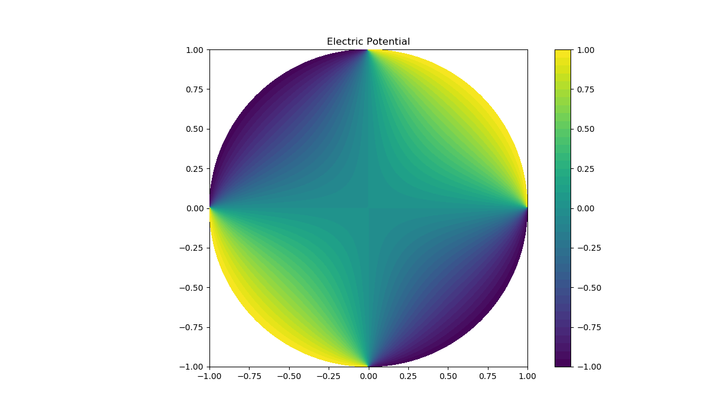

# laplace-solver
Solves the Laplace equation for a specific mesh and boundaries.

## How does this works?
The program reads a generated mesh (from gmsh https://gmsh.info/) and uses the FEniCS Project library in Python (https://fenicsproject.org/) to solve partial differential equations
(in this case the Laplace equation for an electromagnetic problem from Jackson). The boundaries (ansatz) are defined based on the used mesh.
In this example we have a long hollow cylinder divided into 4 different regions with alternating potentials (V=+1V and V=-1V) (Jackson problem 2.14). 

## Example
```
$~python3 laplace-solver.py
Solving linear variational problem.
*** Warning: Degree of exact solution may be inadequate for accurate result in errornorm.
error_L2  = 0.9522140841776902
error_max = 1.0
```

